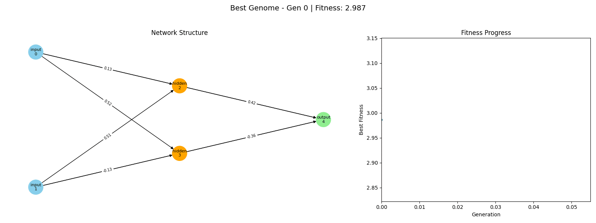

# NEAT XOR

<p align="center">
  
</p>

This project implements a minimal NEAT (NeuroEvolution of Augmenting Topologies) algorithm in Python (NumPy) for solving the XOR problem, with logging and GIF visualization of the evolving neural network and fitness progress.

## Usage

1. Run NEAT and log progress:

   ```sh
   python neat_xor.py
   ```

   This generates `output/progress.json`.

2. Create a GIF of the evolution:

   ```sh
   python make_gif.py
   ```

3. View the result:
   - The GIF will be saved as [`output/progress.gif`](output/progress.gif).

## Requirements

- Python
- numpy
- networkx
- matplotlib
- imageio

Install dependencies with:

```sh
pip install -r requirements.txt
```
